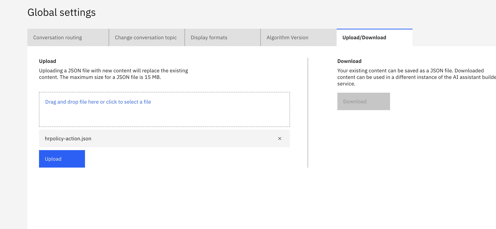

1. Go to prompt lab and `add documents` Create a vector index in watsonx ai.

2. Choose a model until you are satisfied and try chatting with the documents.

3. Please save as `Deployment notebook`. If you haven't created a deployment space please do so before going to this step.

4. Edit the notebook and replace with your `api-key`

5. You should see your AI Service is successfuly deployed. and the Model inference is working properly. You can try run `API_TEST.ipynb` notebook to use it in your own custom application or follow step 6 onwards to integrate this with watsonx-assistant.

6. Firstly create your assistant. Then go to settings. Ensure you select `English`

7. Please upload the action json file

8. You will see action being uploaded

9. Go to integration, we will need to add in an extension to get rid of the error.

10. Click on `add`

11. Fill in as follows and add your api key in.

12. If you go back to actions you will see it is green now 😀

13. Please add in your `deployment_id`

14. Try chat with the docs and Enjoy!
